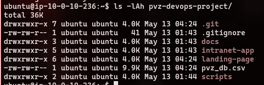
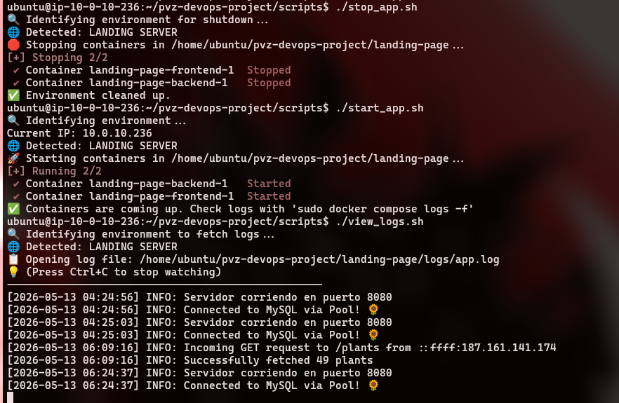
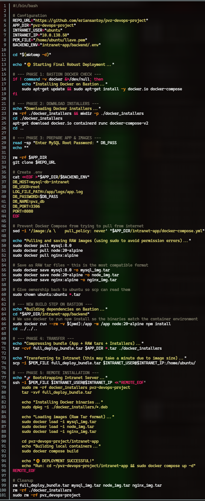

# Instalacion de docker en el servidor de landing

Agregar el usuario actual al grupo docker

Se clona el repositorio de github

Ahora mismo nos interesa landing-page, que es la aplicación que ejecutaremos aquí
En landing-page, tenemos 4 directorios, backend, frontend, logs, y test-env

Landing page se conecta a la base de datos de la intranet, durante las pruebas no era posible tener una base de datos, asi que se creó un docker exclusivo para pruebas con su propia base de datos. Ya al momento de desplegarlo sería cosa de modificar el archivo `.env`

Podríamos bien hacer un `docker compose up -d`, pero para eso, tenemos nuestros scripts

Decidí utilizar pool en lugar de una conexión directa de SQL, porque causaba problemas si es que el backend estaba listo antes que la base de datos y no quería reconectarse... habían muchos problemas con una conexión directa y pool pareció resolverlos.

Hacer el deployment en la instancia de intranet fue significativamente más difícil que todo el resto del proyecto. Tenía que clonar el repo, instalar docker con sus respectivas imágenes en un ambiente sin conexión a internet.

En mi opinión, también es la parte de la que más aprendí y la parte más interesante del proyecto.

Primero configuramos con variables, varias cosas como el nombre de usuario, la IP de destino, el repo etc... Luego verificamos que docker esté instalado en el bastion (donde este script se va a ejecutar). Después **descargaremos** los paquetes de docker, pero sin instalarlos, los descargamos a una carpeta específica. 
Para mayor comodidad, dentro del mismo script se pide la contraseña de la base de datos interactivamente. El script se encarga de generar un archivo `.env` con la contraseña

Utilizamos docker para, de nuevo, **descargar** las imágenes que utilizaremos y guardarlas en un archivo `.tar`. Ahora la parte más interesante, utilizamos docker, para correr `npm install` dentro del contenedor. Evidentemente, en la máquina intranet no vamos a poder ejecutar `npm install` sin internet, así que esto se encarga de preparar `node_modules` para el ambiente que se instalará.

Finalmente una vez que todo esté preparado metemos todos los archivos en un un comprimido .tar y lo envíamos mediante `scp`. Dentro del servidor, mediante `ssh` descomprimimos el archivo y preparamos todo.

Dentro de la intranet, tenemos los mismos scripts de iniciar y detener (detectan dinámicamente el ambiente y realizan la acción correspondiente.)

Cuando el docker se inicia, ejecutamos automáticamente un archivo `setup.sql`. Este archivo crea la tabla principal que necesitamos
